# Ledger — a personal wiki I can talk to, running on my own laptop

**Brian Arevalo Ramos · MBA 290T Fundamentals of Agentic AI · Class 5, Assignment 4 · 2026-09-29**

Ledger is a command-line assistant that answers from my own project notes using a local open-weight model,
`gemma4:e2b` (5.1B parameters, Q4_K_M), with no internet connection.
The CLI and the harness are my own project, written in plain Python with no third-party packages and built with an AI
coding assistant (see the note at the end). It has three modes that behave differently on purpose:

| Mode | What it does | Uses the model | Uses my notes | Uses the conversation |
|---|---|---|---|---|
| `search` | Shows the original passages and where they come from | no | yes | no |
| `ask` | Neutral, standalone answer with citations, or an explicit "insufficient evidence" | yes | always | never |
| `chat` | A personal assistant with a voice, for brainstorming, drafting and planning | yes | only when the turn needs them | yes |

Two more commands feed it: `ingest` turns sources into a linked wiki that I can browse in Obsidian, and `help`
explains everything. This README is the entry point: every claim links to a saved file, and the numbers in it are
read from those files by [`scripts/build_readme.py`](scripts/build_readme.py).

## Results at a glance


All four questions below were run **with Wi-Fi off**, after restarting the CLI ([full offline session](evidence/offline/session.txt)).

| Test | Question | Kind | Result | Passage with expected strings, rank | Expected section, rank | Passages cited | Time | Evidence |
|---|---|---|---|---|---|---|---|---|
| test-1 | What was the mean evaluation score of the Pac-Man agent before and after training? | answerable | answered | [1, 2] | [2] | [1] | 42.52 s | [card](evidence/offline/ask/test-1.md) |
| test-2 | Which skill did my tiny language model fail to pick up, and what wrong word did it choose? | answerable | answered | [3] | [2] | [3] | 35.03 s | [card](evidence/offline/ask/test-2.md) |
| test-3 | How does the networking tracker stop one user from reading another user's contacts? | answerable | answered | — | [3, 4] | [1, 4] | 39.05 s | [card](evidence/offline/ask/test-3.md) |
| test-4 | Which GPU did I buy to train models at home? | unsupported | insufficient evidence | — | — | — | 27.18 s | [card](evidence/offline/ask/test-4.md) |

Three answerable questions were answered from retrieved passages with checked citations, and the question my
sources cannot answer got an explicit refusal. It did not work the first time: [section 8](#8-what-failed-first-and-what-i-changed)
keeps the first run, where test 2 failed, the two bugs in my own harness that it exposed, and the retrieval change
that got test 3 its right section (runs 3 and 4).

## 1. Purpose and sources

**What the wiki is for.** It is my memory of the projects I built in this course: what I built, what I measured,
what failed and what I said I would try next. The questions I want it to answer are the ones I actually ask myself a
month later: "what score did that reach?", "why did that fail?", "what did I say I would try next?".

**Sources.** Three write-ups I authored for earlier assignments. They are my own work and already public in my own
repositories, so they are shareable, and I know them well enough to check every answer. Originals are copied
byte-for-byte into [`vault/raw/`](vault/raw/) and never modified; the harness only reads them.

| ID | Source in the vault | Original file | Origin | Words | SHA-256 |
|---|---|---|---|---|---|
| S1 | [`vault/raw/Custom LLM README.md`](<vault/raw/Custom LLM README.md>) | `README.md` | github.com/BuildingBrian/custom-llm @ 3854cd2 | 8,168 | `c8971e5d4ef04c14…` |
| S2 | [`vault/raw/Networking Tracker README.md`](<vault/raw/Networking Tracker README.md>) | `README.md` | github.com/BuildingBrian/networking-tracker @ 556f732 | 4,153 | `791a30402c37434d…` |
| S3 | [`vault/raw/Pac-Man DQN README.md`](<vault/raw/Pac-Man DQN README.md>) | `README.md` | github.com/BuildingBrian/pacman-dqn @ 4c476c9 | 3,186 | `605a0ab0e419df4d…` |

**How an original becomes a wiki page.** `ingest` gives each source a stable id, cuts it into sections, and asks
local Gemma to draft one note per subject from the section text. The harness, not the model, chooses the file name,
the folder, the properties and the source references, so every note in [`vault/wiki/`](vault/wiki/) carries links
back to the exact section of the original it came from. Each draft is then read against its source, corrected where
needed, and marked `reviewed: true`. The map from source sections to notes is [`data/plan.json`](data/plan.json); the source catalog is
[`data/catalog.json`](data/catalog.json) and is also printed at the bottom of [`vault/index.md`](vault/index.md).

## 2. Setup and exact commands

Requirements: macOS or Linux, Python 3.9 or newer (standard library only), and [Ollama](https://ollama.com) as the
local runtime. While online, once:

```bash
git clone https://github.com/BuildingBrian/personal-wiki.git && cd personal-wiki
ollama pull gemma4:e2b          # official Gemma weights, 7.16 GB; nothing else is downloaded
ollama list                       # confirm the model is stored locally before going offline
```

Model weights are not in this repository. The exact identifier is `gemma4:e2b`, digest `7fbdbf8f5e45`,
from the Ollama library's official Gemma listing. There is no embedding model, no tokenizer download and no pip
install: retrieval is a keyword index built with the standard library.

Then, online or offline:

```bash
./wiki help                                   # commands, configuration, required inputs
./wiki ingest vault/raw                       # read sources, rebuild the search index, draft linked notes
./wiki search "row level security"            # original passages and paths, no model
./wiki ask "What was the mean evaluation score of the Pac-Man agent before and after training?"
./wiki chat                                   # the assistant; /help inside lists /search /ask /sources /save /quit
./wiki check                                  # names, headings, links, source references
./wiki status                                 # model, runtime, device, network, index
./wiki test                                   # the four ask tests and the mode checks, saved under evidence/
```

`--mode local` is the default and the only mode implemented. `--mode online` prints a message saying so and exits.

## 3. Device, model, and why this model

| | |
|---|---|
| Computer | 2019 MacBook Pro 16-inch, macOS 26.6.2, x86_64 |
| CPU | Intel(R) Core(TM) i7-9750H CPU @ 2.60GHz, 6 cores |
| RAM | 32 GB total, 13.7 GB available when measured |
| GPU | Intel UHD Graphics 630, 1536 MB, AMD Radeon Pro 5300M, 4 GB (dedicated VRAM 4 GB; **not used**: the runtime reports 100% CPU) |
| Free disk | 19.4 GB |
| Model | `gemma4:e2b` · family gemma4 · 5.1B parameters · gguf |
| Quantization | Q4_K_M |
| Runtime | Ollama 0.20.7, HTTP API on `127.0.0.1:11434` |
| Context used | 4096 tokens, the same in every mode |
| Python | 3.14.3 |

Source: [`evidence/model_card.json`](evidence/model_card.json), written by `./wiki status --save`.

**Why E2B.** Memory is not my constraint, speed is. This is an Intel Mac, so there is no unified memory and the
runtime does not use the Radeon GPU: everything runs on six CPU cores. I measured before building
([`tests/EXPECTATIONS.md`](tests/EXPECTATIONS.md)): the model reads a prompt at roughly 50 to 60 tokens per second
and writes at about 15 to 18. A 3,000-token prompt took 72 seconds to read. E4B or the 26B model would fit in
32 GB of RAM but would be slower still, and my wiki is small enough that the smallest model answers
correctly once retrieval gives it the right passage. So I chose the smallest model that works and spent the design
effort on keeping prompts short.

**Measured on this laptop.**

| Measurement | Value | Source |
|---|---|---|
| Model memory while loaded | 7.68 GB, 100% CPU | `ollama ps` via [`model_card.json`](evidence/model_card.json) |
| One `ask` answer | 27.18 to 42.52 s (prompt 1386 to 1647 tokens) | [evidence/offline/ask/](evidence/offline/ask/) |
| Drafting the wiki, 22 notes | median 39.23 s per note; 14.2 min of model time for 21 notes | [pass 2 log](evidence/ingest/pass-2-curated-plan.log), [report](evidence/ingest/) |
| Text passed to Gemma for one note | 211 to 771 words (464 to 2250 tokens) | same report |
| Reading speed / writing speed | 46.1 / 14.4 tokens per second | same report |
| Offline re-ingestion of one source | 3.5 min, 5 notes drafted, 0 duplicates | [offline ingest report](evidence/ingest/) |
| Search index | 121 passages from 3 sources, rebuilt in under a second | [`data/index/passages.json`](data/index/passages.json) |

One drafting call is excluded from the timing: it took 1317 s because the laptop went to sleep with its lid closed in the middle of it. The note it produced is normal.

## 4. Architecture: model, retrieval tool, RAG workflow, CLI, harness

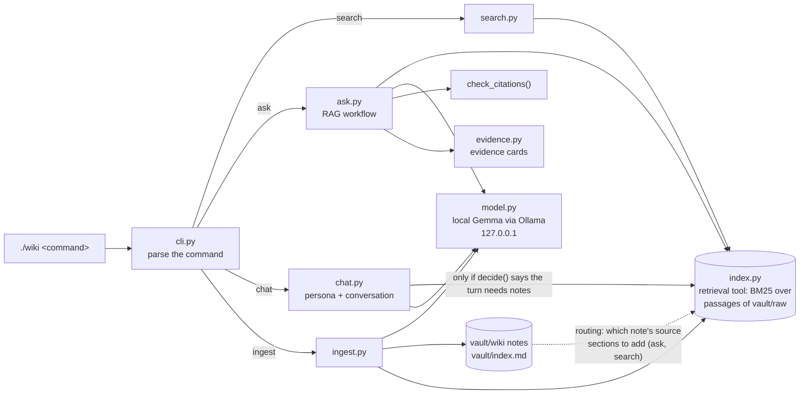
```mermaid
flowchart LR
    U["./wiki &lt;command&gt;"] --> CLI["cli.py<br/>parse the command"]
    CLI -->|search| S["search.py"]
    CLI -->|ask| A["ask.py<br/>RAG workflow"]
    CLI -->|chat| C["chat.py<br/>persona + conversation"]
    CLI -->|ingest| I["ingest.py"]
    S --> R[("index.py<br/>retrieval tool: BM25 over<br/>passages of vault/raw")]
    A --> R
    C -->|"only if decide() says the turn needs notes"| R
    A --> M["model.py<br/>local Gemma via Ollama<br/>127.0.0.1"]
    C --> M
    I --> M
    A --> K["check_citations()"]
    A --> E["evidence.py<br/>evidence cards"]
    I --> W[("vault/wiki notes<br/>vault/index.md")]
    I --> R
    W -.->|"routing: which note's source<br/>sections to add (ask, search)"| R
```

| Part | What it is here | File |
|---|---|---|
| **Model** | Local Gemma. It generates text from the instructions and context it is given. It does not read my files, remember conversations or decide anything about retrieval. | called only from [`harness/model.py`](harness/model.py) |
| **Retrieval tool** | Code that searches a local keyword index and returns original passages with source path, section and line numbers. For `ask` and `search` it also finds the reviewed wiki note that best matches the question and adds up to two passages from that note's source sections. What it returns is always original source text. Works with the model switched off. | [`harness/index.py`](harness/index.py), [`harness/chunking.py`](harness/chunking.py) |
| **RAG workflow** | Retrieve passages, put them in a prompt, have the model answer from them. Used by `ask` always and by `chat` sometimes. It supplies context at answer time. It does not train Gemma: the weights never change. | [`harness/ask.py`](harness/ask.py) |
| **CLI** | The terminal interface. It parses one command and hands it to one mode. | [`wiki`](wiki), [`harness/cli.py`](harness/cli.py) |
| **Harness** | Everything around the model: mode selection, instructions and persona, conversation context, the retrieval decision, prompt assembly, the model call, citation checks, error messages and saved outputs. | [`harness/`](harness/) |

### One question, traced through the code

`./wiki ask "What was the mean evaluation score of the Pac-Man agent before and after training?"`

1. [`wiki`](wiki) calls `cli.main()`, which parses the command and calls `ask.run(question)`. No chat history exists in this process.
2. `ask.run` calls `index.retrieve`. [`textutil.terms`](harness/textutil.py) lowercases the question, drops stopwords and strips endings, giving `mean, evalu, score, pac, man, agent, train`. BM25 scores every passage. `index.route` scores the 22 wiki notes the same way; the best one here is "Pac-Man DQN Project". Up to two passages from that note's source sections that share at least 2 terms with the question replace the weakest keyword hits. The result is 4 passages with path, section, line numbers and how each was found.
3. `ask.build_messages` reads the research rules from [`prompts/wiki-instructions.md`](prompts/wiki-instructions.md) as the system message. The user message is the question, the four numbered passages with their source labels, and the question again.
4. `model.chat` posts that to `http://127.0.0.1:11434/api/chat` with thinking off, temperature 0.1, context 4096 and at most 220 output tokens, and measures the timing.
5. Back in `ask.run`: if the reply contains `INSUFFICIENT EVIDENCE`, the answer is the refusal. Otherwise `check_citations` confirms that every `[n]` refers to a passage that was actually retrieved and that every figure in the answer appears in a cited passage. An answer with no valid citation is withheld and reported as insufficient evidence.
6. `ask.show` prints the answer and the cited paths. With `--save` or `./wiki test`, [`evidence.py`](harness/evidence.py) writes the evidence card with the question, passages, raw reply, checks, model identity, network state and timing.

### How the harness handles each responsibility

| Responsibility | How |
|---|---|
| Choosing a mode | The user chooses with the command. Inside chat, `/search` and `/ask` run those modes without leaving the conversation. |
| Conversation context | `chat.py` keeps the last 6 messages. Retrieved passages are attached to the current turn only, never stored as history. `ask` and `search` receive no history at all. |
| Deciding whether to retrieve | `chat.decide()`, rules first then scores. Questions about the assistant and follow-ups such as "make that shorter" never retrieve. Messages that refer to the wiki always retrieve. Otherwise it retrieves only if the best passage matches at least 2 terms, covers at least half of the message's terms, and scores at least 6.0. The decision is printed on every turn. |
| Building prompts | `ask`: research rules + passages. `chat`: persona + history + passages when retrieved, or an explicit note that nothing was looked up. `ingest`: the note title + at most 900 words of source. |
| Calling Gemma | One function, `model.chat`, local only. |
| Checking citations | `ask.check_citations`, described above. In chat, a reply that used passages but cites none is flagged as unverified. |
| Errors | Runtime not running, model not downloaded, index missing, source not found and script file missing each print what is wrong and the command that fixes it. `search` keeps working when the model is unavailable. Actual messages: [`evidence/error-handling.txt`](evidence/error-handling.txt). |
| Saved outputs | Evidence cards as JSON and Markdown, chat transcripts, ingestion reports, and every model call in a local log. Drafts saved from chat with `/save` go to `outputs/`, never into the wiki. |

## 5. Design choices

| Choice | Value | Why |
|---|---|---|
| Passage size | about 130 words, at most 190 | Four passages are about 1,500 tokens, which this CPU reads in about 25 seconds. Passages are cut at headings and paragraph boundaries; long tables are cut by rows with the header repeated so a row never loses its column names. |
| Retrieval method | BM25 keyword index, heading words counted twice, plus routing through the best-matching wiki note (at most 2 of the 4 passages) | No download, no embedding model, works offline by construction, and I can explain every score. Keyword search misses a section that says the same thing in other words; test 3 showed it (section 8). The routing step uses the reviewed notes, whose titles and summaries name the concept ("Row Level Security"), to reach the source section the question did not share words with. |
| What is indexed | The original sources as evidence; the wiki notes only for routing | Citations must point to evidence, not to a model's summary of it. A note is never sent to Gemma. It only decides which of its source sections join the candidates. |
| Passages per question | 4 for ask, 3 for chat | More passages means more reading time and more distraction for a small model. |
| Context window | 4096 tokens in every mode | Changing the context size makes the runtime reload the model, which costs about 11 seconds. |
| Research rules | [`prompts/wiki-instructions.md`](prompts/wiki-instructions.md) | Neutral voice, cite every fact, copy figures exactly, refuse in two fixed words so the harness can detect it. |
| Assistant personality | [`prompts/persona.md`](prompts/persona.md): "Ledger", direct and practical | The persona file also lists what the assistant can and cannot do, so "what can you help me with?" is answered from instructions rather than from notes. |
| Thinking | switched off | With thinking on, this model spent its whole output budget on hidden reasoning and returned an **empty reply** in my first call. |
| Temperature | 0.1 ask, 0.2 ingest, 0.5 chat | Facts should be repeatable; conversation can vary. |
| Note names | 2 to 5 words, Title Case, chosen by the harness from a plan | The model never writes a file name, so hashes, timestamps and sentence-length names cannot reach the vault. `./wiki check` enforces it. |
| Folders | `Projects`, `Results`, `Concepts`, `Lessons` | They match the questions I ask: what was it, what did it score, how does it work, what went wrong. |
| Source ids | `S1`, `S2`, `S3` in note properties, the catalog and evidence files | Readable names for people, stable ids for machines. Original file names are kept in the catalog. |
| Re-ingestion | The plan decides the file, so the same source always writes the same notes | A note I have reviewed is never overwritten; the fresh draft goes to `data/drafts/`. A generated note that is no longer in the plan is moved out of the vault. |

## 6. The wiki in Obsidian

The vault is the [`vault/`](vault/) folder itself: 22 notes in `wiki/`, 3 originals in `raw/`, and `index.md` as the landing page. Code, the search index, evidence and drafts all live outside it.

**An open note: short file name, matching heading, related notes with reasons, and source references that link to the exact section of the original.**

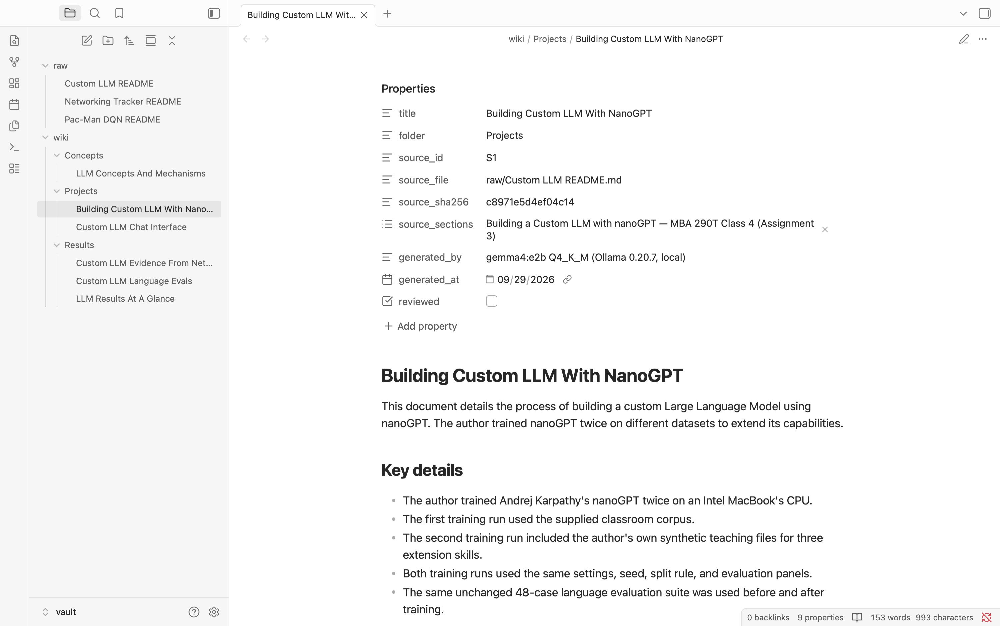

**The landing page grouped by topic, with the page list on the left.**

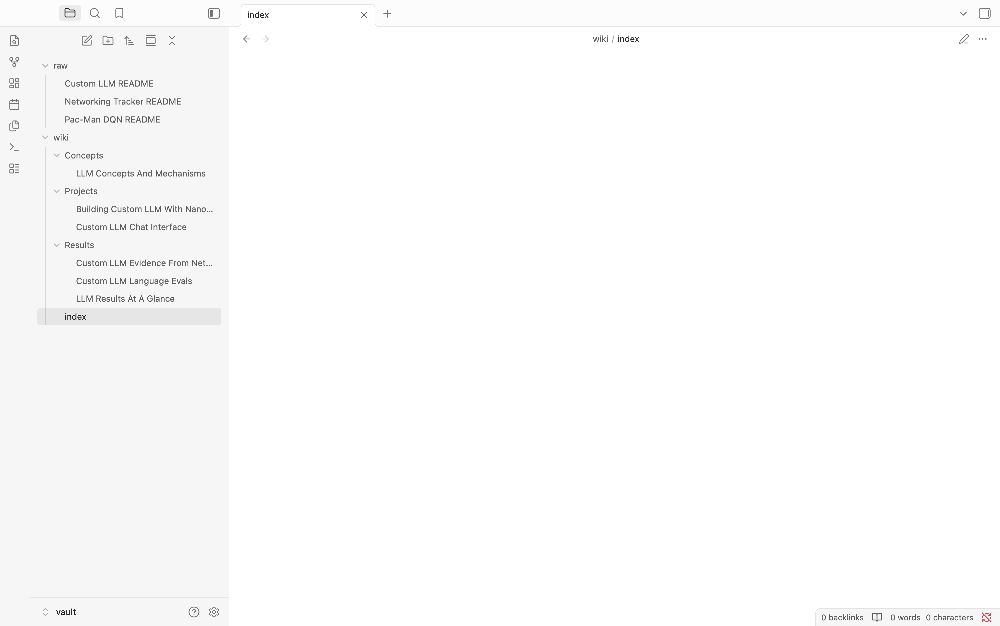

**Graph view, filtered with `path:wiki/`, attachments off, colored by folder.**


The screenshots are Obsidian's own window contents, captured by [`scripts/obsidian_shots.py`](scripts/obsidian_shots.py)
through the app's developer interface. The graph filter and colors are saved in
[`vault/.obsidian/graph.json`](vault/.obsidian/graph.json), so opening the vault reproduces the same view.

**From the model's draft to a reviewed wiki.** Ingestion ran twice, and both passes are kept.

| | Pass 1: Gemma's own plan | Pass 2: after my cleanup |
|---|---|---|
| Notes | 21 | 22 |
| Titles | Several generic ones: *Initial Expectations*, *Experiment Next Steps*, *Training Results Analysis* | Every title names its subject: *Pac-Man Training Choices*, *Negation Failure*, *Row Level Security* |
| Folders | 15 of 21 notes in `Projects` | Spread over `Projects`, `Results`, `Concepts`, `Lessons` |
| Evidence | [plan](evidence/ingest/pass-1-model-plan.json) · [log](evidence/ingest/pass-1-model-plan.log) | [plan](data/plan.json) · [log](evidence/ingest/pass-2-curated-plan.log) |

I edited the plan, not the files: I renamed vague titles, split two notes that covered seven sections each, and added
the `Concepts` notes. Re-ingesting then rewrote the notes under their new names and moved the 15 notes that were no
longer in the plan out of the vault, so **no duplicate or stale note remained**. Then every draft was read against its
source, by my AI assistant and me: **30 corrections in 15 of 22 notes**, for example a note that stated my prediction as if it
were the result, and one that said all five Pac-Man games improved when one got worse. Of the
58 links the harness and model proposed, I kept
19 as written, reworded 18, removed
21 and added 27. Every change is listed in the
[review log](evidence/review-log.md). The originals in `raw/` were never edited.

**Links and names, checked two ways.** `./wiki check` verifies every file name, heading, link and source reference, and Obsidian's own link resolver was asked for unresolved links:

```
CHECK  22 wiki notes · 130 links · 41 source references
  file names 2 to 6 words, no machine-style names, first heading = file name, every note in the plan,
  every link resolves to exactly one file, every source reference points to a real heading

  0 problems

Obsidian's own resolver (app.metadataCache.unresolvedLinks), wiki/ and index.md:
  {}   <- empty means every link resolves

Re-ingesting all three unchanged sources:
  created 0 · updated 0 · kept reviewed 0 · already up to date 22
  notes in vault/wiki: 22 before, 22 after · files outside the plan (duplicates): 0
  done in 0.3 s
```

**One note, traced to a related note and back to the original evidence.**

1. [`vault/index.md`](vault/index.md) lists **Negation Failure** under *Lessons*.
2. [`vault/wiki/Lessons/Negation Failure.md`](<vault/wiki/Lessons/Negation Failure.md>) says negation scored 1/3 and that the
   model chose `tea`, the negated word. Its *Related notes* link to **Custom LLM Eval Results** with the reason
   "Gives the scores by category, where negation is the only taught category at chance."
3. [`vault/wiki/Results/Custom LLM Eval Results.md`](<vault/wiki/Results/Custom LLM Eval Results.md>) gives 20 and 30 correct
   of 48 and links back. Its *Sources* point to `Custom LLM README § Results at a glance` and `§ 4.1`.
4. The first note's *Sources* link `Custom LLM README § 7. One limitation and my next experiment` opens the original at
   lines 519 to 528 of [`vault/raw/Custom LLM README.md`](<vault/raw/Custom LLM README.md>), where the sentence reads:
   "Negation transfer failed (1/3, chance) … it picked the *negated* word (`tea`)".

| The related note, reached by its link | The original passage, reached by the source reference |
|---|---|
| 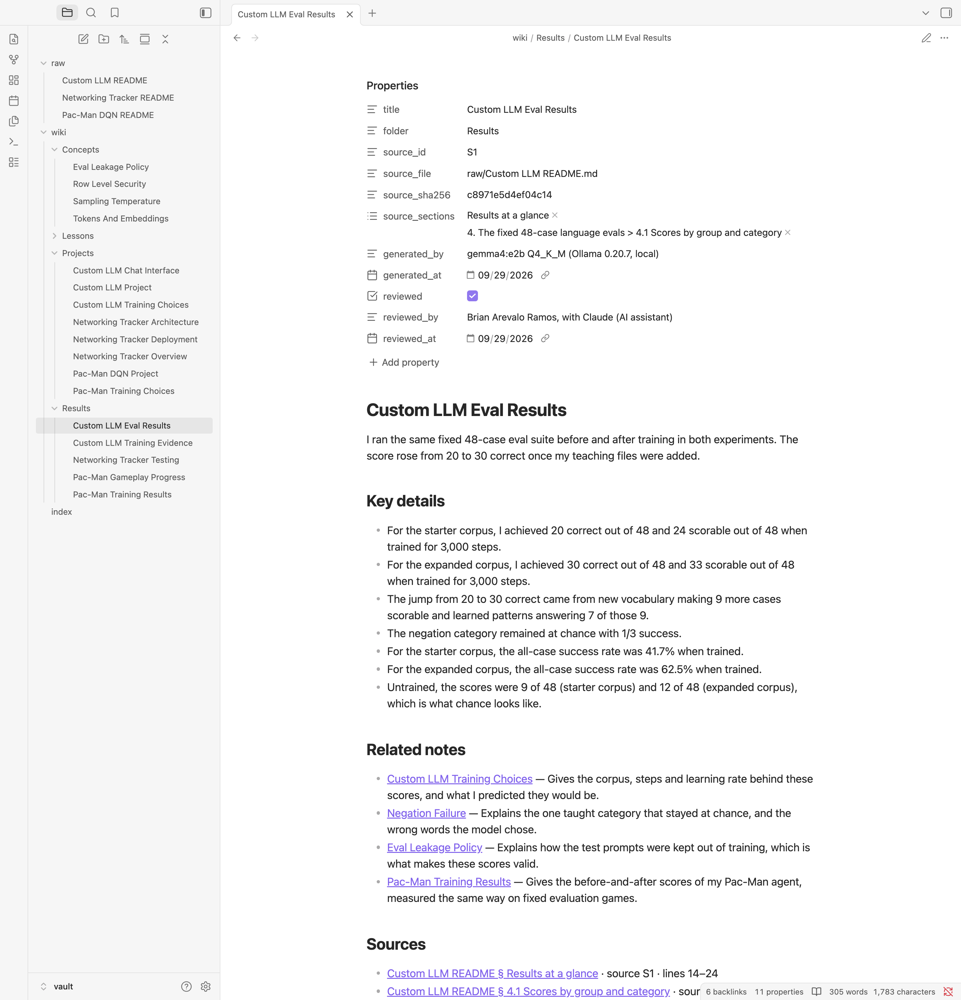 | 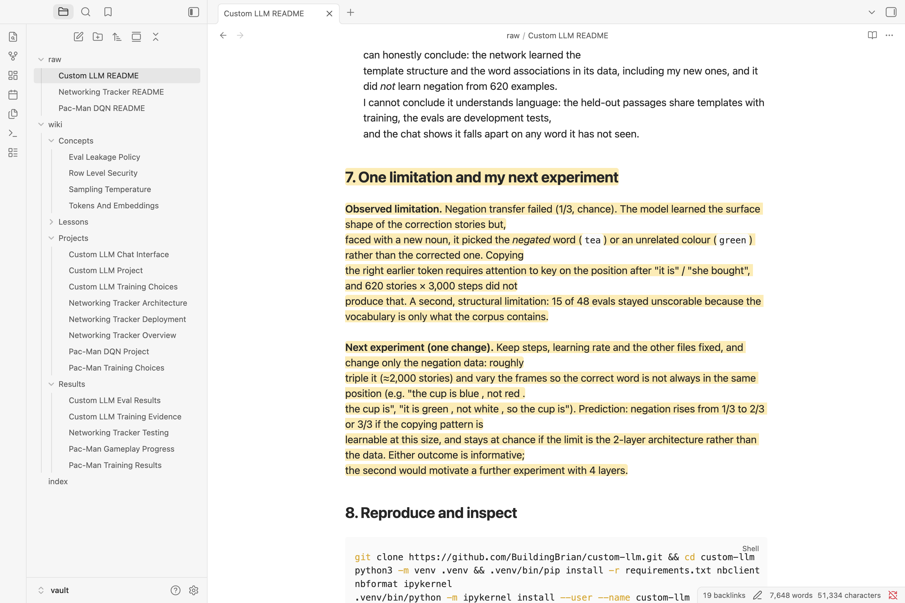 |

The same passage is what `ask` retrieved and cited for test 2, so the wiki a person browses and the evidence the model
answers from lead to the same lines.

## 7. The four ask-mode tests

The questions, the expected sources and my predictions were committed before any retrieval code existed
([`tests/questions.json`](tests/questions.json), [`tests/EXPECTATIONS.md`](tests/EXPECTATIONS.md), first commit).
The test file lives outside the vault and is never indexed.

### test-1: What was the mean evaluation score of the Pac-Man agent before and after training?

*Direct question answered by one source.*

- **Expected:** Mean of the five fixed evaluation games: 492.0 untrained, 608.0 trained (+116.0). Source: `vault/raw/Pac-Man DQN README.md` › The five before-and-after scores.
- **Retrieved passages:**
  1. `vault/raw/Pac-Man DQN README.md` › Ms. Pac-Man DQN — Class 3 assignment (lines 3–17, score 21.27)
  2. `vault/raw/Pac-Man DQN README.md` › 4. What actually happened > The five before-and-after scores (lines 125–138, score 13.11)
  3. `vault/raw/Pac-Man DQN README.md` › 3. What I expected before training (lines 87–98, score 12.71)
  4. `vault/raw/Pac-Man DQN README.md` › 5. What the agent sees, does, and is rewarded for (plain language) (lines 202–216, score 9.52, found via wiki note: Pac-Man DQN Project)
- **Actual answer (answered):** The mean score over the same five evaluation games for the untrained network was 492.0, and for the trained agent was 608.0 [1]. The change in mean score was +116.0 [1].
- **Citation check by the harness:** cited [1], all retrieved; figures in the answer ['116.0', '492.0', '608.0']; figures missing from the cited passages none.
- **My assessment after opening the cited passages:** Correct. The cited passage [1], the summary at the top of the write-up, contains 492.0, 608.0 and +116.0, and the harness found every figure of the answer in it. The score table itself (passage 2) was retrieved too but not cited this time. Routing replaced the fourth passage, which changed the prompt, and the model now cites one passage where run 3 cited two; both are correct. The raw reply opened with a bare "[1]". The harness now strips a citation that opens the answer and keeps the raw reply in the card.
- **Full record:** [evidence/offline/ask/test-1.md](evidence/offline/ask/test-1.md)

### test-2: Which skill did my tiny language model fail to pick up, and what wrong word did it choose?

*Phrased differently from the source, to see how retrieval handles wording. The source says 'negation', 'failure', 'chose tea, the negated word'; the question says none of those except 'choose'.*

- **Expected:** Negation (1 of 3, chance). On the 'ava did not buy tea' case it chose 'tea', the negated word. Source: `vault/raw/Custom LLM README.md` › 4.3 Reading the results honestly.
- **Retrieved passages:**
  1. `vault/raw/Custom LLM README.md` › 5. Chat interface (lines 451–467, score 9.28)
  2. `vault/raw/Custom LLM README.md` › 4. The fixed 48-case language evals > 4.3 Reading the results honestly (lines 399–424, score 9.24)
  3. `vault/raw/Custom LLM README.md` › 7. One limitation and my next experiment (lines 519–528, score 8.66)
  4. `vault/raw/Custom LLM README.md` › 5. Chat interface (lines 479–486, score 3.38, found via wiki note: Custom LLM Chat Interface)
- **Actual answer (answered):** Negation transfer failed [3]. The model picked the negated word, such as "tea", instead of the corrected one, or an unrelated color like "green" [3].
- **Citation check by the harness:** cited [3], all retrieved; figures in the answer none; figures missing from the cited passages none.
- **My assessment after opening the cited passages:** Correct, and this is the test that failed first. The cited passage says "Negation transfer failed (1/3, chance)" and that the model "picked the negated word (tea) or an unrelated colour (green)". It was ranked third, behind two that merely share the words "language" and "model" with the question. Keyword retrieval matched the question's wording, not its meaning, which is what I predicted. Routing added a second "Chat interface" passage at rank 4, which the answer ignores: for this question the router picked the wrong note (section 11).
- **Full record:** [evidence/offline/ask/test-2.md](evidence/offline/ask/test-2.md)

### test-3: How does the networking tracker stop one user from reading another user's contacts?

*Third source, known supporting evidence in more than one section.*

- **Expected:** Row Level Security inside Postgres: a row is reachable only when auth.user_id() = user_id, enforced by the database rather than application code. Source: `vault/raw/Networking Tracker README.md` › Authentication and RLS ownership.
- **Retrieved passages:**
  1. `vault/raw/Networking Tracker README.md` › Production verification (lines 376–388, score 17.57)
  2. `vault/raw/Networking Tracker README.md` › Tests > Test output (lines 297–326, score 15.04)
  3. `vault/raw/Networking Tracker README.md` › Authentication and RLS ownership (lines 249–265, score 10.85, found via wiki note: Row Level Security)
  4. `vault/raw/Networking Tracker README.md` › Authentication and RLS ownership (lines 224–247, score 7.69, found via wiki note: Row Level Security)
- **Actual answer (answered):** The networking tracker uses Row Level Security (RLS) policies to prevent one user from reading another user's contacts [1]. The ownership rule is that a row is reachable only when `auth.user_id() = user_id` [4]. This is enforced through policies such as `contacts_select_own` which uses the condition `auth.user_id() = user_id` for selecting contacts [4].
- **Citation check by the harness:** cited [1, 4], all retrieved; figures in the answer none; figures missing from the cited passages none.
- **My assessment after opening the cited passages:** Correct, and now complete on the mechanism. In runs 1 to 3 the answer only said that Row Level Security keeps contacts private. The section that explains how ranked 6th and never reached the model. Now both passages of "Authentication and RLS ownership" are retrieved, at ranks 3 and 4, found via the note "Row Level Security". I opened passage 4: it states "a row is reachable only when `auth.user_id() = user_id`" word for word and contains the `contacts_select_own` policy the answer quotes. The first sentence cites passage 1, the production test run, whose test names read "RLS: one user cannot reach another user's contacts". That supports the claim, though the word "policies" comes from passage 4. Compared with my expected answer, one point is missing: that the database, not application code, enforces the rule. Passage 4 says so ("the database — not the application — decides who owns a row"), but the answer does not repeat it. The automatic string check still reports NOT RETRIEVED, because that section writes "RLS" and never "Row Level Security" (section 8).
- **Full record:** [evidence/offline/ask/test-3.md](evidence/offline/ask/test-3.md)

### test-4: Which GPU did I buy to train models at home?

*Plausible question the sources cannot answer. One source says I am CONSIDERING hardware for training at home; none says I bought anything. The tempting passage will be retrieved, so this tests honesty, not retrieval.*

- **Expected:** An explicit statement that the sources do not contain this information.
- **Retrieved passages:**
  1. `vault/raw/Custom LLM README.md` › 9. Reflection and where I go from here (lines 559–570, score 10.91)
  2. `vault/raw/Custom LLM README.md` › 4. The fixed 48-case language evals > 4.3 Reading the results honestly (lines 399–424, score 5.56)
  3. `vault/raw/Custom LLM README.md` › 4. The fixed 48-case language evals > 4.4 How eval material stayed out of training (lines 428–433, score 4.48)
  4. `vault/raw/Custom LLM README.md` › 9. Reflection and where I go from here (lines 548–557, score 3.06, found via wiki note: Next Steps And Hardware)
- **Actual answer (insufficient evidence):** Insufficient evidence: the wiki sources do not contain this information.
- **Why it refused:** the model found no answer in the passages.
- **My assessment after opening the cited passages:** Correct refusal, and the hard kind. The tempting passage was retrieved at rank 1: it says I am "considering hardware for training models at home". Routing added a second passage from the same reflection section at rank 4, via the note "Next Steps And Hardware", so the model saw more of the temptation than before. It still did not turn considering into buying. Rule 6 of the research rules was written for exactly this case.
- **Full record:** [evidence/offline/ask/test-4.md](evidence/offline/ask/test-4.md)

## 8. What failed first, and what I changed

The first run is kept untouched in [`evidence/runs/run-1-initial/`](evidence/runs/run-1-initial/).

Run 2 is kept in [`evidence/runs/run-2-after-rule-change/`](evidence/runs/run-2-after-rule-change/).

Run 3, the first complete offline run, used keyword retrieval only and is kept in [`evidence/runs/run-3-offline-before-routing/`](evidence/runs/run-3-offline-before-routing/). The final run is run 4.

| Test | Run 1 | Run 2 | Run 3 (offline, keyword only) | Final run | Expected section rank, run 3 → final |
|---|---|---|---|---|---|
| test-1 | answered | answered | answered | answered | [2] → [2] |
| test-2 | insufficient evidence | answered | answered | answered | [2] → [2] |
| test-3 | answered | answered | answered | answered | — → [3, 4] |
| test-4 | insufficient evidence | insufficient evidence | insufficient evidence | insufficient evidence | — → — |

**The failure: test 2.** The right passage was retrieved at rank 3 ("Negation transfer failed … it picked the negated
word (`tea`)"), and a second supporting passage at rank 2, but the model replied INSUFFICIENT EVIDENCE. My
prediction was half right: I expected this test to fail because keyword search cannot match "skill it failed to pick
up" to "negation". Retrieval did rank the passage lower than two others for that reason, but it was still in the
top 4. The refusal was the model's. My first rules told it that related information is not an answer, and with a
question worded differently from the passage it took that literally.

**The change.** One edit to the research rules and one to the prompt layout, both in
[`prompts/wiki-instructions.md`](prompts/wiki-instructions.md) and `ask.build_messages`: rule 1 now says the passages
may use different words than the question, and the question is stated before the passages as well as after. I reran
the affected tests. Test 2 is now answered with the correct citation, and both refusals (test 4 and the separation
check) still refuse, which was the risk of loosening the rule. The rules as used in run 1 are saved next to that run.

**A second, smaller change after run 2.** Test 1 was correct but read "[1] … [1]. [2] … [2].": the model began each
sentence with a passage number and stated the fact twice. I tightened rule 7, and the model then answered in clean
prose but copied the score table out of the passage, even when told not to. The harness now removes table lines from
the answer it displays and keeps the untouched reply in the evidence card as `raw_model_reply`
([run 2 notes](evidence/runs/run-2-after-rule-change/README.md)).

**Two bugs in my own harness, found by run 1.** The network flag said "offline" while the laptop was online,
because it relied on one outside connection and this Mac's per-app firewall blocks some of those. The harness now reads
the operating system (Wi-Fi power and default route) as well, and reports offline only when there is no route and no
probe succeeds. And model memory was read before the model had loaded. Details in the
[run 1 notes](evidence/runs/run-1-initial/README.md).

**The third failure, found after the first offline run: test 3 answered from the wrong section.** The answer was
correct, but thin. Its passages were the test output and the production check, which show *that* one user cannot read
another's contacts. The section that explains *how*, "Authentication and RLS ownership", ranked 6th and never reached
Gemma. The cause is the limitation named in section 11. The question's words (networking tracker, another, user,
reading, contacts) are repeated most in the passages that restate the result. The explaining section says "RLS",
"policies" and `auth.user_id()` instead. The harness also had a flaw of its own: its automatic check looked for a
passage containing both "Row Level Security" and `auth.user_id()`, but that section only ever says "RLS", so the check
could not pass there even with perfect retrieval. I kept that check unchanged and added a second one, from the same
test file written before the code: is a passage from the expected section retrieved?

**The change.** A routing step in `index.retrieve`: the question is also scored against the 22 reviewed wiki notes,
and up to two passages from the best note's source sections replace the weakest keyword hits. For test 3 the best
note is "Row Level Security", and both passages of "Authentication and RLS ownership" now reach Gemma at ranks 3 and 4.
Search uses the same retrieval, so what I inspect is what the model gets. I reran all four tests and the mode checks
online and then offline (run 4). The other expected passages are still retrieved, and chat's retrieval decisions
(which do not use routing) are unchanged at 0 misjudged of 17.

## 9. Mode checks

| Check | I typed | Harness decision | Ledger replied |
|---|---|---|---|
| capabilities | what can we do? | skipped: question about the assistant itself | We can look at what you're working on. We have the nanoGPT language model, the Ms. Pac-Man agent, and the networking tracker app. What's the next step you want to tackle? |
| capabilities | what can you help me with? | skipped: question about the assistant itself | I can help you brainstorm ideas, plan experiments, draft text, and look up information from the project wiki. Tell me what you want to work on next. |
| draft from notes | Draft a short plan for my next Pac-Man experiment. | looked up 3 passages: the message names a project (pac man) | Suggestion: We could try adjusting the hyperparameters for the Ms. Pac-Man agent. Here is a draft plan: 1. **Explore Hyperparameters:** Test different values for exploration rate, training games, and the learning rate to see if we can achieve a smoother or higher score. 2. **Focus on Exploration:** Since the training curve was … |
| follow-up | make that shorter | skipped: follow-up on the conversation | Okay, shorter. Plan: Adjust hyperparameters (exploration rate, learning rate) for the Pac-Man agent. Focus on smoothing the training curve. |

Full transcript: [evidence/offline/mode-checks/chat-capabilities-and-followup.md](evidence/offline/mode-checks/chat-capabilities-and-followup.md)

**Search** returns original passages with paths and line numbers and makes no model call: [evidence/offline/mode-checks/search-check.txt](evidence/offline/mode-checks/search-check.txt).

**A claim made only in chat is not evidence.** In chat I said I had decided to name my next project Falcon ([chat side](evidence/offline/mode-checks/separation-chat-side.md)). Then, in a fresh `ask`: "What name did I decide on for my next project?" → **insufficient evidence** ([ask side](evidence/offline/mode-checks/separation-ask-side.md)). Ask never sees chat history, and chat messages are never written into the vault or the index.

**What the checks show.** Both capability questions were answered from the persona, with no lookup, no citation and no refusal. The plan request named a project, so the harness looked up three passages, and the reply labelled itself a suggestion and cited passage 3. "make that shorter" used the conversation and made no lookup. **Two weaknesses are visible in the transcript.** The plan cites my *prediction* as if it were a result: "Since the training curve was jagged [3]" points at "What I expected before training", which I wrote before the run started. Its other citation, that the setup is a small fraction of the original paper's experience, is supported by the same passage. And the plan is generic. It proposes tuning exploration, learning rate and training length, while my own write-up proposes a specific next experiment, a ten-times-larger replay memory. That section was not among the three passages retrieved, because it never uses the word "Pac-Man", and chat does not yet use the note routing that ask and search now use. Chat also does not enforce a citation on every fact the way ask does; it only flags a reply that used passages but cites none.

## 10. Offline demonstration

Run with `Run offline demo.command` after turning Wi-Fi off. The script refuses to start while the Mac is connected. Each `./wiki` command is a new process, so the CLI was restarted after the network was gone. Recorded network state during the tests: Wi-Fi Off, default route False, outside host answered False.

| Step | Command | Evidence |
|---|---|---|
| Network state | `networksetup`, `route`, `ping` | [session.txt](evidence/offline/session.txt) |
| Help and status | `./wiki help`, `./wiki status` | same file |
| Ingestion with local Gemma | `./wiki ingest "vault/raw/Pac-Man DQN README.md" --force` | same file, and the [offline ingest report](evidence/ingest/) |
| Search | `./wiki search "row level security"` | same file |
| Four ask tests | `./wiki test` | [evidence/offline/ask/](evidence/offline/ask/) |
| Chat, search and separation checks | `./wiki test` | [evidence/offline/mode-checks/](evidence/offline/mode-checks/) |

An earlier attempt at 16:33 was stopped because Wi-Fi came back on during ingestion. Its partial output is kept in [evidence/runs/offline-attempt-1-wifi-came-back/](evidence/runs/offline-attempt-1-wifi-came-back/) and is not used as offline evidence. The run above was repeated from the start with Wi-Fi off throughout.

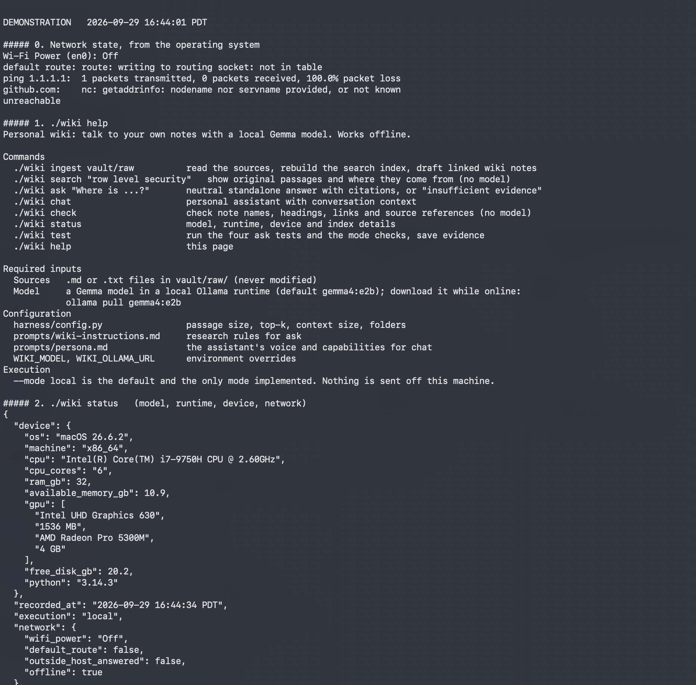

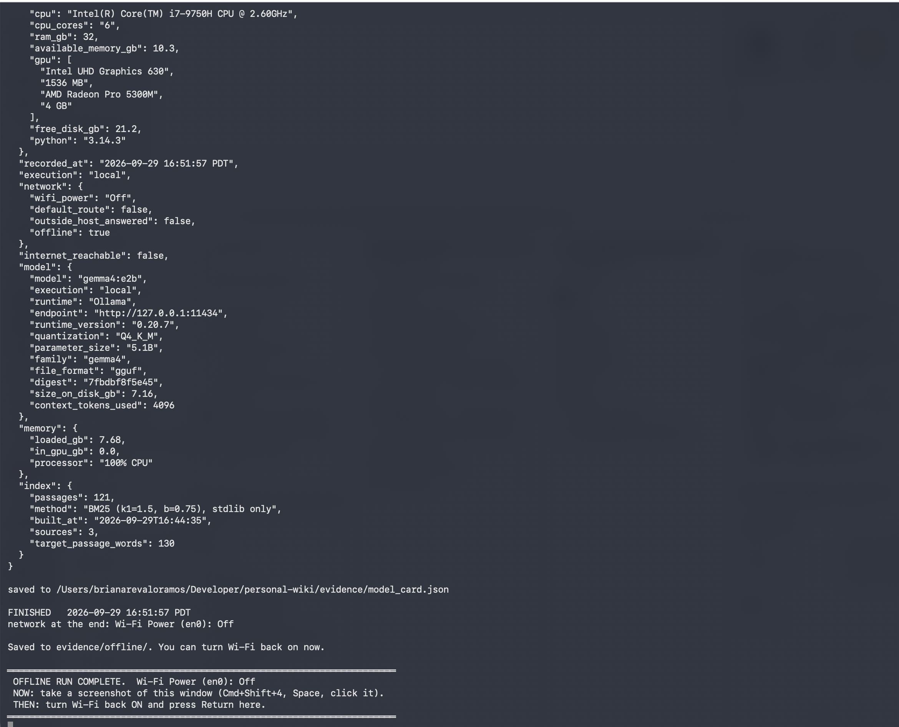

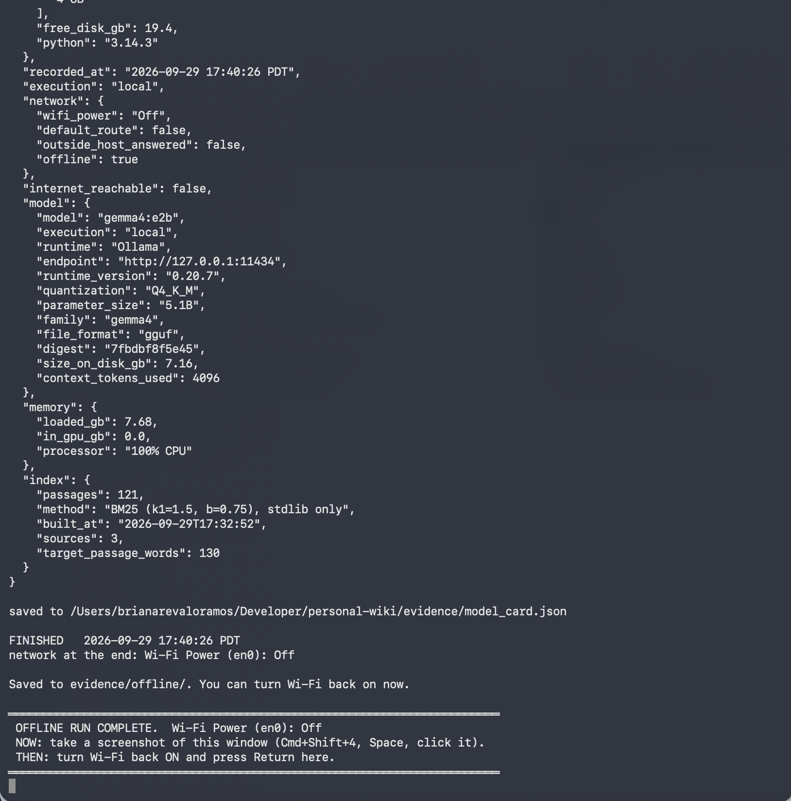

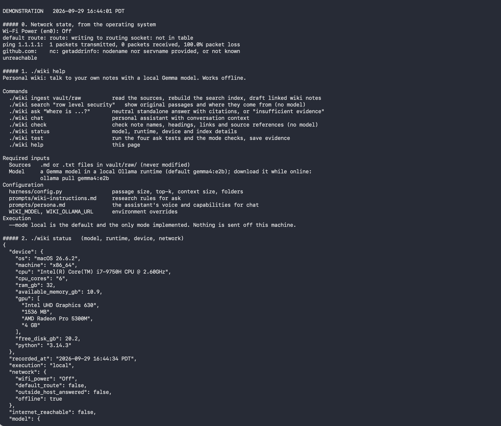

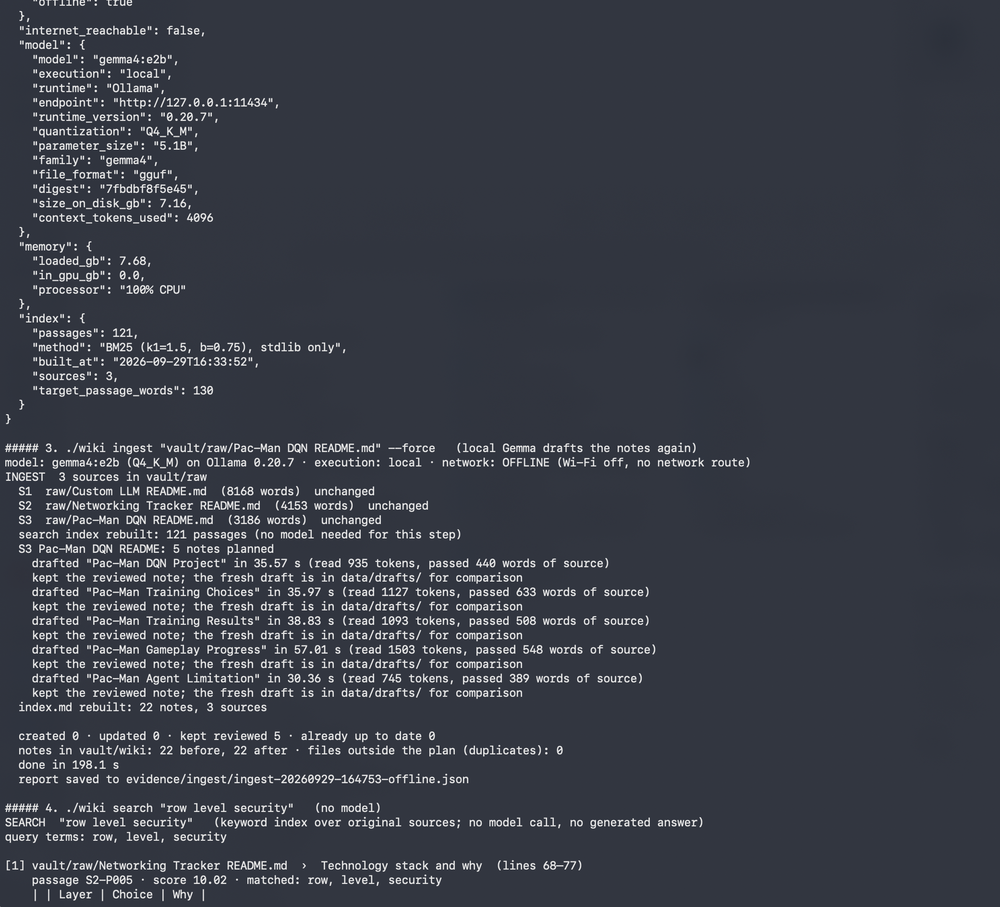

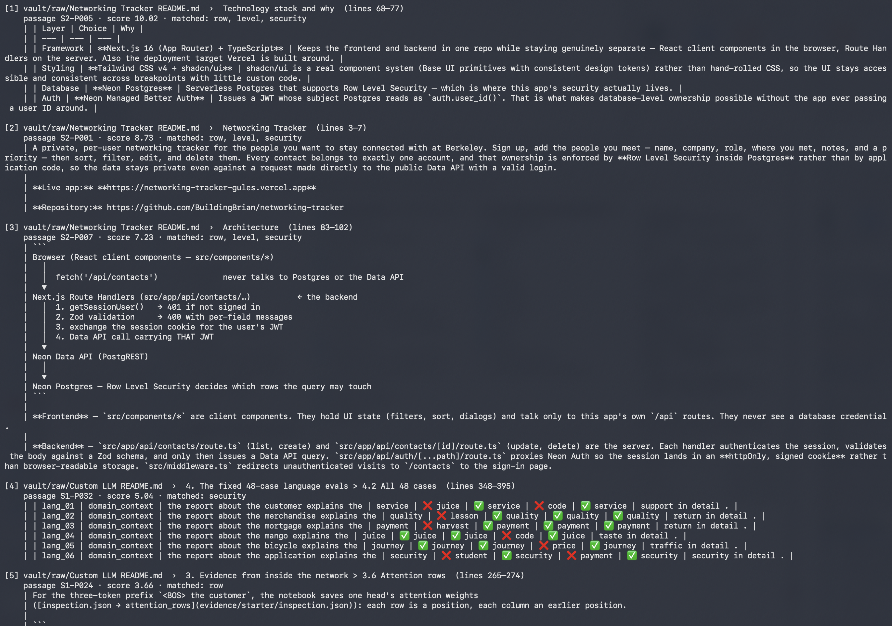

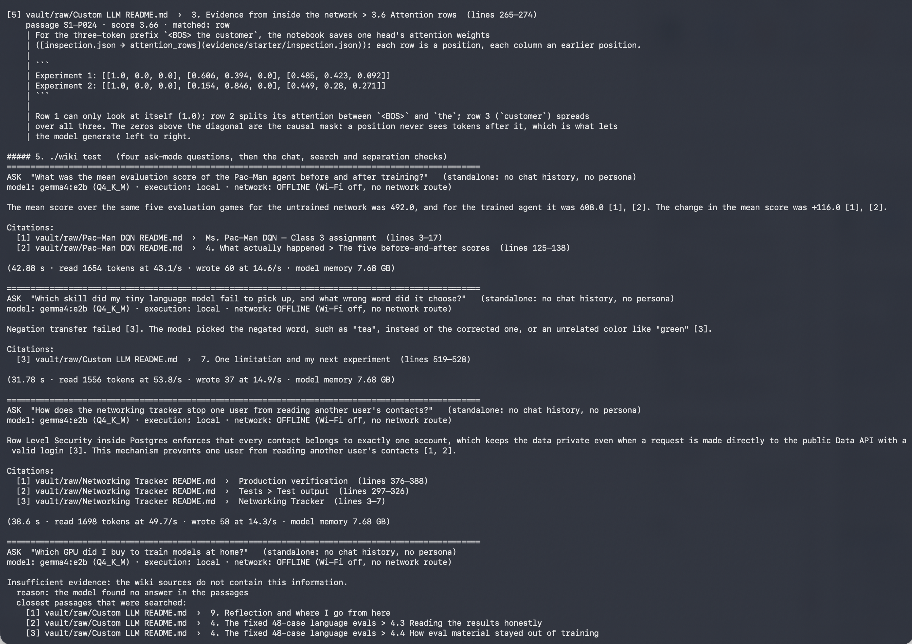

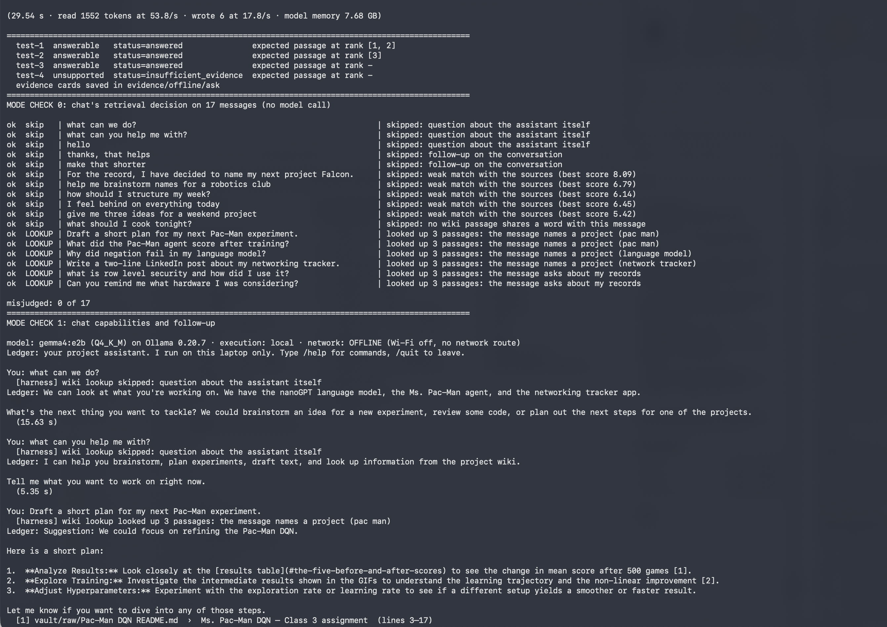

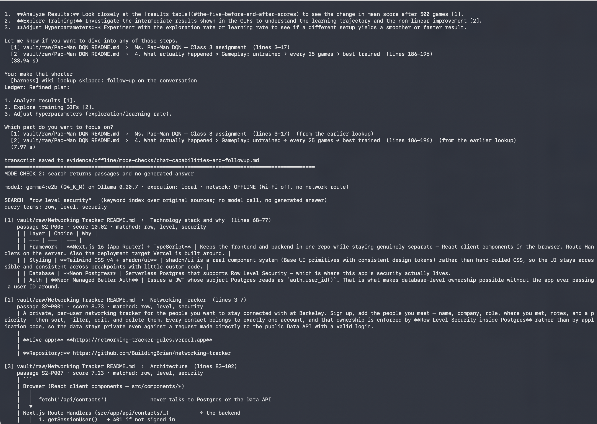

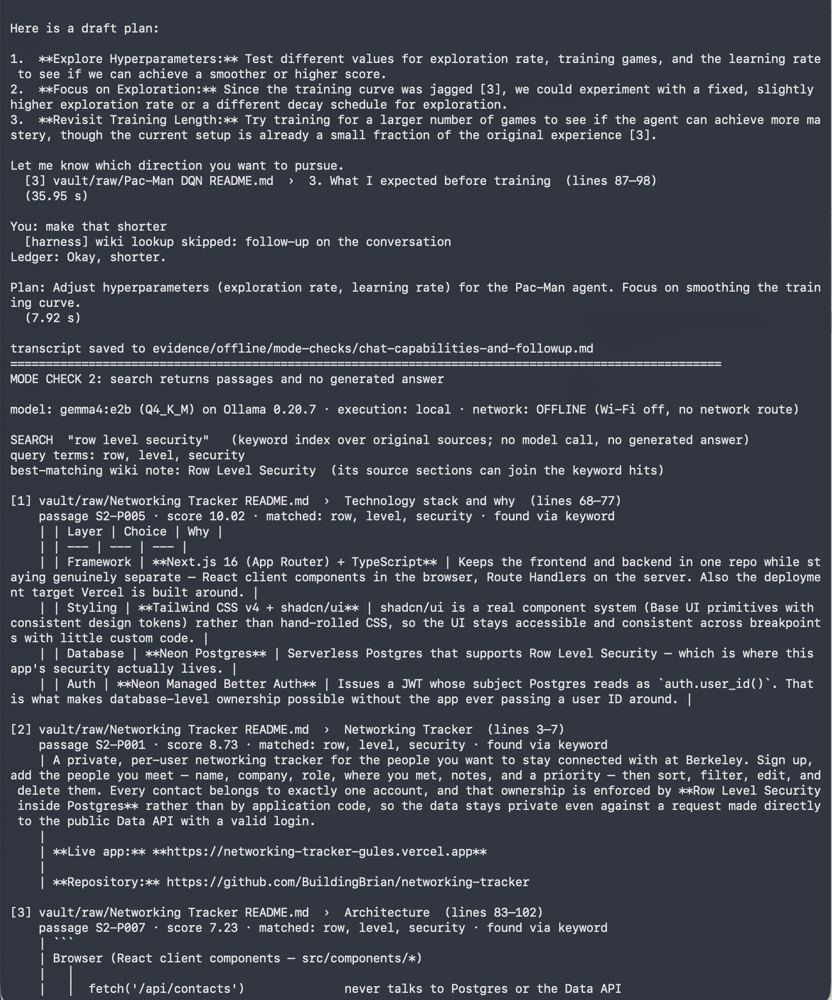

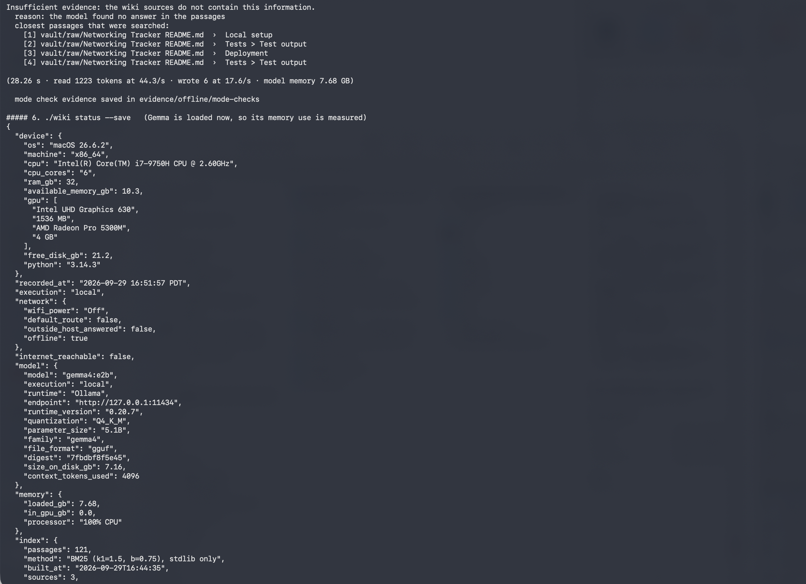

## 11. Reflection: one limitation and one improvement

**Limitation: keyword retrieval finds words, not meaning, and a passage carries no memory of the document it came from.** In test 3 the question says "stop" and "reading", while the section that explains the mechanism says "RLS", "policies" and "reachable". In runs 1 to 3 that section ranked 6th and never reached Gemma, so the answer was correct but never stated the rule `auth.user_id() = user_id`. In chat, a request for "my next Pac-Man experiment" retrieves the introduction, the gameplay section and my expectations, but not the section with the experiment I actually planned, because that section never says "Pac-Man". A reader knows which project it belongs to; the index does not.

**Improvement I tried: let the reviewed wiki route the search** ([section 8](#8-what-failed-first-and-what-i-changed)). The question is also scored against the 22 wiki notes, and up to two passages from the best note's source sections join the four sent to Gemma. It needs no new model and stays offline. I set the success test before trying it: the expected section in the top four for test 3, without test 4 starting to answer. Result: test 3's section moved from rank 6 to ranks 3 and 4, the answer now states the ownership rule with a citation to that section, test 4 still refuses, and the other expected passages are still retrieved.

**What is still wrong, and what I would try next.** Routing is only as good as the note match. For test 2 it picked "Custom LLM Chat Interface" (score 7.15) over "Negation Failure" (6.94). The title counts double, and my simple stemmer does not reduce "failure" to the question's "fail". The routed passage was useless but harmless, because the right passage was already retrieved by keyword. Chat does not use routing yet, so its Pac-Man plan is still generic. Next I would give chat the same retrieval, then try local embeddings (`embeddinggemma` through Ollama) for paraphrases. I would measure both with the same four questions and the expected-section rank the harness now records.

**Smaller limitations I observed.** An answer takes 30 to 40 seconds on this CPU. The model copies tables out of passages even when told not to, so the harness removes them. And it agrees with almost any link it is asked to justify: it wrote a fluent reason for linking *Row Level Security* to *Tokens And Embeddings*, which share only the word "token".

## 12. Repository map

| Path | What it is |
|---|---|
| [`wiki`](wiki), [`harness/`](harness/) | The CLI and the harness. Standard library only. |
| [`prompts/`](prompts/) | Research rules, persona, ingestion instructions. Loaded by the harness per mode. |
| [`vault/`](vault/) | The Obsidian vault: `raw/` originals, `wiki/` notes, `index.md`. |
| [`data/`](data/) | Machine files outside the vault: source catalog, note plan, search index, drafts. |
| [`tests/`](tests/) | The four questions, expectations and my assessments. Never indexed. |
| [`evidence/`](evidence/) | Model card, evidence cards, mode checks, ingestion reports, Obsidian screenshots, offline run, run 1. |
| [`scripts/`](scripts/) | Offline demonstration, Obsidian screenshots, this README's generator. |
| [`Run offline demo.command`](<Run offline demo.command>) | Double-click launcher for the offline demonstration. |

**AI assistance.** This project was built with heavy use of Claude (Anthropic) as an AI coding assistant, in the way the
assignment's starter prompt describes. Claude wrote the harness code, ran the tests, did the first review of the
generated notes against their sources and assembled this README from the saved outputs. It also proposed the sources,
the test questions and the note plan, which I approved. Every result shown is an actual output of local Gemma on my
own laptop, failures included, and nothing was sent to a hosted model at question time.
